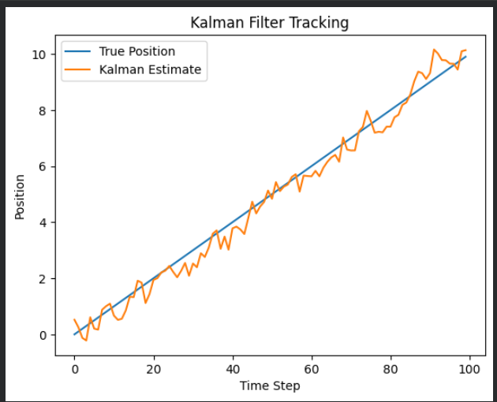

<H3>ENTER YOUR NAME : SANTHOSE AROCKIARAJ J</H3>
<H3>ENTER YOUR REGISTER NO. : 212224230248</H3>
<H3>EX. NO.5</H3>
<H3>DATE : 11/02/2026</H3>
<H1 ALIGN =CENTER> Implementation of Kalman Filter</H1>
<H3>Aim:</H3> To Construct a Python Code to implement the Kalman filter to predict the position and velocity of an object.
<H3>Algorithm:</H3>
Step 1: Define the state transition model F, the observation model H, the process noise covariance Q, the measurement noise covariance R, the initial state estimate x0, and the initial error covariance P0.<BR>
Step 2:  Create a KalmanFilter object with these parameters.<BR>
Step 3: Simulate the movement of the object for a number of time steps, generating true states and measurements. <BR>
Step 3: For each measurement, predict the next state using kf.predict().<BR>
Step 4: Update the state estimate based on the measurement using kf.update().<BR>
Step 5: Store the estimated state in a list.<BR>
Step 6: Plot the true and estimated positions.<BR>
<H3>Program:</H3>

```python
import numpy as np
import matplotlib.pyplot as plt


# -----------------------------------
# Define Kalman Filter Class
# -----------------------------------
class KalmanFilter:
    
    def __init__(self, F, H, Q, R, x0, P0):
        # Store system matrices
        self.F = F      # State transition matrix
        self.H = H      # Observation matrix
        self.Q = Q      # Process noise covariance
        self.R = R      # Measurement noise covariance
        
        # Initialize state and covariance
        self.x = x0     # Initial state [position, velocity]
        self.P = P0     # Initial uncertainty covariance matrix

    # -----------------------------------
    # Prediction Step
    # -----------------------------------
    def predict(self):
        # Predict next state
        # x̂ = F * x
        self.x = self.F @ self.x
        
        # Predict next covariance
        # P = F * P * F^T + Q
        self.P = self.F @ self.P @ self.F.T + self.Q

    # -----------------------------------
    # Update Step
    # -----------------------------------
    def update(self, z):
        # Innovation (measurement residual)
        # y = z - Hx
        y = z - self.H @ self.x
        
        # Innovation covariance
        # S = HPH^T + R
        S = self.H @ self.P @ self.H.T + self.R
        
        # Kalman Gain
        # K = P H^T S^-1
        K = self.P @ self.H.T @ np.linalg.inv(S)
        
        # Updated state estimate
        # x = x + K*y
        self.x = self.x + K @ y
        
        # Updated covariance
        # P = (I - KH)P
        I = np.eye(self.F.shape[0])
        self.P = (I - K @ self.H) @ self.P


# -----------------------------------
# Define System Parameters
# -----------------------------------

dt = 0.1  # Time step

# State transition matrix (constant velocity model)
F = np.array([[1, dt],
              [0, 1]])

# Observation matrix (we measure only position)
H = np.array([[1, 0]])

# Process noise covariance (model uncertainty)
Q = np.diag([0.1, 0.1])

# Measurement noise covariance (sensor noise)
R = np.array([[1]])

# Initial state: position = 0, velocity = 0
x0 = np.array([0, 0])

# Initial uncertainty
P0 = np.diag([1, 1])

# Create Kalman Filter object
kf = KalmanFilter(F, H, Q, R, x0, P0)


# -----------------------------------
# Generate True States and Noisy Measurements
# -----------------------------------

true_states = []
measurements = []

for i in range(100):
    # True motion: constant velocity = 1
    true_position = i * dt
    true_velocity = 1
    
    true_states.append([true_position, true_velocity])
    
    # Add Gaussian noise to position measurement
    noisy_measurement = true_position + np.random.normal(scale=1)
    measurements.append(noisy_measurement)


# -----------------------------------
# Apply Kalman Filter to Measurements
# -----------------------------------

est_states = []

for z in measurements:
    kf.predict()                   # Step 1: Predict next state
    kf.update(np.array([z]))       # Step 2: Correct using measurement
    est_states.append(kf.x.copy())


# -----------------------------------
# Plot Results
# -----------------------------------

plt.plot([s[0] for s in true_states], label="True Position")
plt.plot([s[0] for s in est_states], label="Kalman Estimate")

plt.legend()
plt.xlabel("Time Step")
plt.ylabel("Position")
plt.title("Kalman Filter Tracking")
plt.show()

```

<H3>Output:</H3>



<H3>Results:</H3>
Thus, Kalman filter is implemented to predict the next position and   velocity in Python


